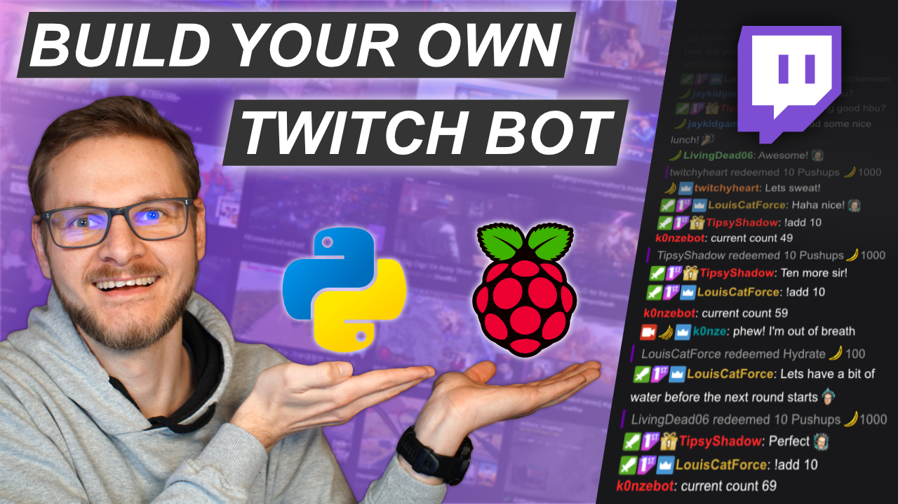

# Twitch  Bot  - RoundWon specific flavors

The following repo intends to build upon the boiler plate code kindly provided by the repository we forked from. Included is also a very helpful Youtube video from the developer who created the boilerplate code walks you through some first steps on setting up a Rasberry Pi to run this bot if you need tha help.

The first section details significant advancements which were made to the original boiler plate code which allows for administering "power" abilities onto your users and adding additional commands which can link to  other 


Simple Twitch bot template with following commands:
#### Original K0nze commands - modified for my needs
 * `!counts`: shows the `count` from [`data.json`](./data.json)
 * `!add <NUMBER>`: adds `NUMBER` to `count` in  [`data.json`](./data.json). Available to mods only
 * `!sub <NUMBER>`: subtracts `NUMBER` from `count` in  [`data.json`](./data.json). Available to mods only

 ### New RoundWon commands
 * `!joke`: returns a random chuck norris joke - is also called every 10 chats
 * `!help`: returns the available functions in the bot
 * `!rules`: returns the chat rules
 * `!available`: returns a list of games I have availble to play - linked to Game_Meta table which tracks games that have been downloaded and games that have not.
 * `!add-game <NUMBER>`: adds a game request to the GameRequest table. Chatters are limited to being able to add a game request every 5 minutes. The counts of each game are used to update the TopGames count table and use the top 2 most voted games as options in the next poll. -- command currently being tested
 * `!poll-game`: Pulls from a table linked to Twitch Schedule (script to pull Twitch Schedule and map to Database to be provided) and creates a poll on StrawPolls using API connnection. Once poll is created, url is updated into StrawPolls table and linked to schedule_id. Only broadcaster can run this.
 * `!poll-available`: Retrieves the available Polls in StrawPoll database and the current results for each poll. Only Mods can run this. Is also run every 20 chat messages before reverting the count to 0 again.
 * `!poll-announce <NUMBER>`: Announces the available poll every 30 minutes for a number of times specified by the broadcaster. After the end of the routine, the script closes the poll ( by first determining if the target_game changes. Currently script also automatically deletes the poll but in future iterations, will allow polls to remain for 1 day lag.


## Next Steps

Spam moderation scripts are currently being engineered though likely to be handled by a second bot. Additional routines to retrieve different types of jokes and facts to help boost chat engagement will be pursued after all poll related scripts testing and deployment is finalized.


# Instructions from original repo - helpful 
## Setup Video
<a href="https://youtu.be/CPVSoowZhVw">
    
</a>

[Youtube Video Link](https://youtu.be/CPVSoowZhVw)

## Setup and Run

Requires Python `3.7.3`.

Install necessary packages (locally):

```bash
python3 -m pip install -r requirements.txt
```

Copy `.env.sample` to `.env`

```
cp .env.sample .env

```

Open `.env` and insert the following fields:

| Field        | Explanation                                                           |
|--------------|-----------------------------------------------------------------------|
| `TMI_TOKEN`  | OAuth Token with `oauth:` as a prefix                                 |
| `CLIENT_ID`  | Client ID obtained from Twitch's Developer site                       |
| `BOT_NICK`   | Twitch name of the Bot                                                | 
| `BOT_PREFIX` | Prefix for commands the bot should listen to (set to `!` per default) |
| `CHANNEL`    | The name of the your Twitch channel you want the bot to run at        |

Start Bot:

```
python3 bot.py
```

## Add the Bot to Autostart/systemd (Raspberry Pi OS)

Install necessary packages (globally):

```bash
sudo -H python3 -m pip install -r requirements.txt
```

Open the unit file [`twitch_count_bot.service`](./twitch_count_bot.service) and check if the path to `bot.py` under `[Serivce]` `ExecStart` is correct.

Copy systemd unit file to unit file directory:

```bash
sudo cp twitch_count_bot.service /lib/systemd/system
```

Reload all units:

```bash
sudo systemctl daemon-release
```

Enable the Twitch Count Bot Unit:

```
sudo systemctl enable twitch_count_bot.service
```

Start the bot:

```
sudo systemctl start twitch_count_bot.service
```

Check if the bot is running with:

```
sudo systemctl status twitch_count_bot.service
```

Check if the output of the bot if an error occurs:

```
sudo systemctl enable twitch_count_bot.service
```

## Credits

Follow the creator of original repo at the following links: [![`[YouTube]`](https://img.shields.io/youtube/channel/subscribers/UClinoEvnpv_TzF4HNNaE5cQ?style=social)](https://youtube.com/k0nze) | [![`[Twitch]`](https://img.shields.io/twitch/status/k0nze?style=social)](https://twitch.com/k0nze) | [![`[Discord]`](https://img.shields.io/discord/713121297407672380.svg?label=&logo=discord&logoColor=ffffff&color=7389D8&labelColor=6A7EC2)](https://discord.k0nze.gg) | [![`[Twitter Follow]`](https://img.shields.io/twitter/follow/k0nze_gg?style=social)](https://twitter.com/k0nze_gg)

 Created by Konstantin (Konze) Lübeck

 * Discord: [discord.k0nze.gg](https://discord.k0nze.gg) 
 * Twitch: [twitch.tv/k0nze](https://twitch.tv/k0nze) 
 * Youtube: [youtube.com/k0nze](https://youtube.com/k0nze) 
 * Twitter: [twitter.com/k0nze_gg](https://twitter.com/k0nze_gg) 
 * Instagram: [instagram.com/k0nze.gg](https://instagram.com/k0nze.gg) 
